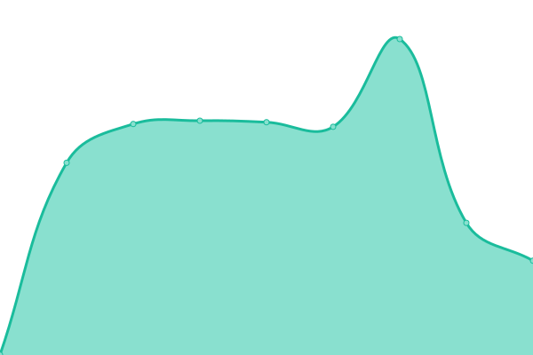

# [📈 Live Status](https://status.flowlity.com): <!--live status--> **🟧 Partial outage**

This repository contains the open-source uptime monitor and status page for [FLOWLITY](https://status.flowlity.com), powered by [Upptime](https://github.com/upptime/upptime).

With [Upptime](https://upptime.js.org), you can get your own unlimited and free uptime monitor and status page, powered entirely by a GitHub repository. We use [Issues](https://github.com/flowlity/upptime/issues) as incident reports, [Actions](https://github.com/flowlity/upptime/actions) as uptime monitors, and [Pages](https://status.flowlity.com) for the status page.

<!--start: status pages-->
<!-- This summary is generated by Upptime (https://github.com/upptime/upptime) -->
<!-- Do not edit this manually, your changes will be overwritten -->
<!-- prettier-ignore -->
| URL | Status | History | Response Time | Uptime |
| --- | ------ | ------- | ------------- | ------ |
|  [App](https://app.flowlity.com) | 🟩 Up | [app.yml](https://github.com/flowlity/upptime/commits/HEAD/history/app.yml) | 

 443ms
     
 | 

<a href="https://status.flowlity.com/history/app">100.00%</a>
    

|  [Database](psql-flexible.postgres.database.azure.com) | 🟩 Up | [database.yml](https://github.com/flowlity/upptime/commits/HEAD/history/database.yml) | 

 123ms
     
 | 

<a href="https://status.flowlity.com/history/database">100.00%</a>
    

|  [Landing Page](https://flowlity.com) | 🟥 Down | [landing-page.yml](https://github.com/flowlity/upptime/commits/HEAD/history/landing-page.yml) | 

 3034ms
     
 | 

<a href="https://status.flowlity.com/history/landing-page">100.00%</a>
    

|  [Airflow](https://airflow.flowlity.com) | 🟩 Up | [airflow.yml](https://github.com/flowlity/upptime/commits/HEAD/history/airflow.yml) | 

 872ms
     
 | 

<a href="https://status.flowlity.com/history/airflow">100.00%</a>
    

|  [Metabase](https://metabase.flowlity.com) | 🟩 Up | [metabase.yml](https://github.com/flowlity/upptime/commits/HEAD/history/metabase.yml) | 

 811ms
     
 | 

<a href="https://status.flowlity.com/history/metabase">100.00%</a>
    

<!--end: status pages-->

[**Visit our status website →**](https://status.flowlity.com)

## 📄 License

- Powered by: [Upptime](https://github.com/upptime/upptime)
- Code: [MIT](./LICENSE) © [FLOWLITY](https://status.flowlity.com)
- Data in the `./history` directory: [Open Database License](https://opendatacommons.org/licenses/odbl/1-0/)
